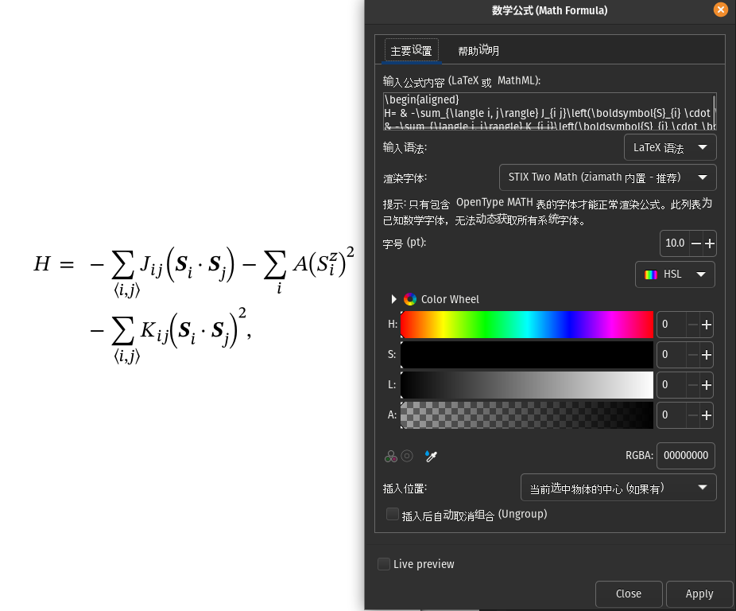

# Inkscape Pymath

[English Version](#inkscape-pymath-1)


## 简介

Inkscape-pymath 是一个纯 Python 实现的 Inkscape 数学公式插件，无需额外依赖，直接在 Inkscape 中渲染 LaTeX 数学公式和化学方程式。

## 功能特点

- 纯 Python 实现，无需安装额外的 LaTeX 引擎
- 支持数学公式和化学方程式（`\ce{}` 命令
- 内置多种数学字体
- 支持自定义字体（需包含 MATH table）
- 支持更改公式颜色
- 支持行内和显示模式

## 安装

### 1. 复制文件

将项目中的以下文件以及文件夹复制到 Inkscape 的extensions文件夹里面：

- `inkscape_math_core/` 文件夹
- `latex_math.inx` 文件

例如：


### 2. Inkscape extensions文件夹目录位置

| 平台                  | 路径                                                             |
| ------------------- | -------------------------------------------------------------- |
| **Linux (原生)**      | `~/.config/inkscape/extensions/`                               |
| **Linux (Flatpak)** | `~/.var/app/org.inkscape.Inkscape/config/inkscape/extensions/` |
| **macOS**           | `~/Library/Application Support/inkscape/extensions/`           |
| **Windows**         | `C:\Users\<用户名>\AppData\Roaming\inkscape\extensions\`          |

## Python 版本要求(可选，仅供了解)

**本节内容为选读项，仅用于帮助您了解 Inkscape 调用 Python 解释器的底层机制。**
Inkscape 默认已内置 Python 运行环境。因此，您通常只需将扩展文件复制到 Inkscape 的扩展目录中，软件即可自动识别并加载，无需额外配置。

若您需更换 Python 解释器，或希望为 Inkscape 配置独立的 Python 虚拟环境，可通过修改 `preferences.xml` 配置文件实现。
该文件的路径因操作系统而异，通常位于以下位置：

| 平台 | 路径 |
|------|------|
| Linux (原生安装) | `~/.config/inkscape/preferences.xml` |
| Linux (Flatpak，推荐) | `~/.var/app/org.inkscape.Inkscape/config/inkscape/preferences.xml` |
| macOS | `~/Library/Application Support/inkscape/preferences.xml` |
| Windows | `C:\Users\<用户名>\AppData\Roaming\inkscape\preferences.xml` |

使用文本编辑器打开 `preferences.xml`，找到或添加 `python-interpreter` 属性以指定 Python 解释器路径。具体操作如下：
定位到 `<group id="extensions">` 节点，在其中添加或修改 `python-interpreter` 属性：

```xml
<group
   id="extensions"
   python-interpreter="/path/to/python"
   other-settings="value" />
```

**注意：**
- `/path/to/python` 需替换为您的 Python 解释器绝对路径（例如 `/usr/bin/python`）。
- Windows 用户需精确指定到 `.exe` 可执行文件。例如，若解释器位于 `C:\Python311\python.exe`，则应配置为 `python-interpreter="C:\Python311\python.exe"`。


## 使用

1. 打开 Inkscape
2. 菜单：扩展 → 文本（Text） → LaTeX Math(数学公式)
3. 输入 LaTeX 公式
4. 选择字体(可选)
5. 点击确定

## 测试公式

### 矩阵运算

```latex
\begin{aligned}
 & 
\begin{bmatrix}
a_{11} & a_{12} & \ldots & a_{1n} \\
a_{21} & a_{22} & \ldots & a_{2n} \\
\ldots & \ldots & \ldots & \ldots \\
a_{m1} & a_{m2} & \ldots & a_{mn}
\end{bmatrix}-
\begin{bmatrix}
b_{11} & b_{12} & \ldots & b_{1n} \\
b_{21} & b_{22} & \ldots & b_{2n} \\
\ldots & \ldots & \ldots & \ldots \\
b_{m1} & b_{m2} & \ldots & b_{mn}
\end{bmatrix} \\
 & =
\begin{bmatrix}
a_{11}-b_{11} & a_{12}-b_{12} & \ldots & a_{1n}-b_{1n} \\
a_{21}-b_{21} & a_{22}-b_{22} & \ldots & a_{2n}-b_{2n} \\
\ldots & \ldots & \ldots & \ldots \\
a_{m1}-b_{m1} & a_{m2}-b_{m2} & \ldots & a_{mn}-b_{mn}
\end{bmatrix} \\
 & 
\begin{bmatrix}
1 & 3 & 5 & 7 \\
2 & 4 & 6 & 8
\end{bmatrix}-
\begin{bmatrix}
4 & 3 & 1 & 4 \\
5 & 3 & 1 & 6
\end{bmatrix}=
\begin{bmatrix}
-3 & 0 & 4 & 3 \\
-3 & 1 & 5 & 2
\end{bmatrix}
\end{aligned}
```

### 二项式展开

```latex
\begin{align}
(a+b)^2 &= (a+b)(a+b) \\
&= a^2 + ab + ba + b^2 \\
&= a^2 + 2ab + b^2
\end{align}
```

### 希腊字母

```latex
\alpha, \beta, \gamma, \delta, \epsilon, \theta, \lambda, \mu, \pi, \sigma, \phi, \omega
```

### 微分方程

```latex
\frac{d\vec{M}}{dt}=-|\gamma|\vec{M}\times\vec{H}_{eff}+\frac{\alpha}{M_s}(\vec{M}\times\frac{d\vec{M}}{dt})
```

### 积分方程

```latex
\begin{aligned}
\mathcal{E} & =\int_{V_\mathrm{m}}\mathrm{d}\mathbf{r}\quad\mathcal{A}\sum_{i=x,y,z}\left|\nabla m_i\right|^2+\mathcal{D}\mathbf{m}\cdot(\nabla\times\mathbf{m})-M_\mathrm{s}\mathbf{m}\cdot\mathbf{B}+ \\
 & +\frac{1}{2\mu_0}\int_{\mathbb{R}^3}\mathrm{d}\mathbf{r}\sum_{i=x,y,z}\left|\nabla A_{\mathrm{d},i}\right|^2,
\end{aligned}
```

### 坐标变换

```latex
\begin{pmatrix} x' \\ y' \end{pmatrix} = \frac{1}{l} \begin{pmatrix} \cos \phi_{\mathrm{A}} & \sin \phi_{\mathrm{A}} \\ -\sin \phi_{\mathrm{A}} & \cos \phi_{\mathrm{A}} \end{pmatrix} \begin{pmatrix} x \\ y \end{pmatrix}
```

### 绝对值函数

```latex
|x| = \begin{cases} x & \text{if } x \ge 0 \\ -x & \text{if } x < 0 \end{cases}
```

### 化学方程式

```latex
\ce{K4[Fe(CN)6] + 6H2O -> 4K+ + [Fe(CN)6]^4-}
\ce{2H2(g) + O2(g) -> 2H2O(l)}
\ce{H2O <=> H+ + OH-}
\ce{Al2(SO4)3 + 6NaOH -> 2Al(OH)3 v + 3Na2SO4}
\ce{CaCO3(s) ->[\Delta] CaO(s) + CO2(g)}
```

## 内置字体

插件内置以下数学字体：

| 字体                    | 特点                                                                                                      |
| --------------------- | ------------------------------------------------------------------------------------------------------- |
| **STIX Two Math**（默认） | STIX（Scientific and Technical Information Exchange）字体的第二代，专为科学和技术排版设计，提供了广泛的数学符号覆盖，外观现代、清晰，适合各种数学和科学文档。 |
| **Latin Modern Math** | 基于 Computer Modern 的现代开源字体，是 TeX/LaTeX 标准字体的继承者，风格经典、优雅，适合传统数学文档和排版。                                    |
| **XITS Math**         | STIX 字体的开源分支，提供了完整的数学符号集，同时支持阿拉伯文和波斯文等 RTL（从右到左）语言的数学排版。                                                |
| **Libertinus Math**   | 基于 Linux Libertine 字体的开源数学字体，风格优雅、易读，适合书籍、论文等正式文档。                                                      |

## 自定义字体限制

自定义字体必须包含 **MATH table**（OpenType 数学表）。

### 为什么常见字体如 Times New Roman、Arial 不能使用？

普通文字字体（如 Times New Roman、Arial、Helvetica 等）虽然包含基本的数学符号（如 `+`、`-`、`=`），但它们**不包含 OpenType MATH table**。

数学公式排版需要：

- 专门设计的数学符号（各种大小的括号、积分、求和等）
- 精确的数学间距和对齐规则
- 上标/下标位置调整
- 分数、根式等复杂结构的支持

这些功能都需要 MATH table 来实现。因此，即使是常见的优秀文字字体，也无法直接用于数学公式渲染。

如果您想使用类似 Times New Roman 的字体风格，建议使用 STIX Two Math 或 XITS Math，它们的风格与 Times New Roman 相似，但专门为数学排版设计。

## 贡献和 Issue

欢迎贡献代码、报告问题或提出改进建议！

- 如果您发现了 bug，请提交 Issue
- 如果您有功能建议，欢迎提出
- 如果您想贡献代码，欢迎提交 Pull Request

我们非常感谢任何形式的贡献！

***

# Inkscape Pymath

[中文版本](#inkscape-pymath)


## Introduction

Inkscape-pymath is a pure Python Inkscape math formula extension, no additional dependencies needed, renders LaTeX math formulas and chemical equations directly in Inkscape.

## Features

- Pure Python implementation, no extra LaTeX engine required
- Supports math formulas and chemical equations (`\ce{}` command
- Multiple built-in math fonts
- Custom font support (must include MATH table)
- Formula color customization
- Inline and display modes

## Installation

### 1. Copy Files

Copy the following to your Inkscape extensions directory:

- `inkscape_math_core/` folder
- `latex_math.inx` file
  

### 2. Inkscape Extensions File Folder Directory Locations

| Platform            | Path                                                           |
| ------------------- | -------------------------------------------------------------- |
| **Linux (native)**  | `~/.config/inkscape/extensions/`                               |
| **Linux (Flatpak)** | `~/.var/app/org.inkscape.Inkscape/config/inkscape/extensions/` |
| **macOS**           | `~/Library/Application Support/inkscape/extensions/`           |
| **Windows**         | `C:\Users\<Username>\AppData\Roaming\inkscape\extensions\`     |

## Python Version Requirement (Optional)

**This section is optional and is provided solely to help you understand how Inkscape uses the Python interpreter.**
Inkscape typically comes with a bundled Python environment. Therefore, you only need to copy the extension into Inkscape's extensions directory, and Inkscape will handle the rest automatically.

If you need to change the Python interpreter or configure a dedicated Python virtual environment for Inkscape, you can modify the `preferences.xml` file.
The location of `preferences.xml` varies by platform. Typically, you can find it at:

| Platform | Path |
|----------|------|
| Linux (Native) | `~/.config/inkscape/preferences.xml` |
| Linux (Flatpak, Recommended!) | `~/.var/app/org.inkscape.Inkscape/config/inkscape/preferences.xml` |
| macOS | `~/Library/Application Support/inkscape/preferences.xml` |
| Windows | `C:\Users\<Username>\AppData\Roaming\inkscape\` |

Open and edit the `preferences.xml` file, then modify (or add, if missing) the `python-interpreter` attribute to point to your desired Python executable. Specifically:
Locate the `<group id="extensions">` section and set the `python-interpreter` attribute to specify the Python interpreter to use:

```xml
<group
   id="extensions"
   python-interpreter="/path/to/python"
   other-settings="value" />
```
**Note:** Replace `/path/to/python` with the exact path to your Python interpreter (e.g., `/usr/bin/python`). On Windows, you must specify the full path to the `.exe` executable.
For example, if your interpreter is located at `C:\Python311\python.exe`, set the attribute as `python-interpreter="C:\Python311\python.exe"`.


## Usage

1. Open Inkscape
2. Menu: Extensions → Text → LaTeX Math(数学公式)
3. Enter LaTeX formula
4. Select font (optional)
5. Click Apply

## Test Formulas

### Matrix Operations

```latex
\begin{aligned}
 & 
\begin{bmatrix}
a_{11} & a_{12} & \ldots & a_{1n} \\
a_{21} & a_{22} & \ldots & a_{2n} \\
\ldots & \ldots & \ldots & \ldots \\
a_{m1} & a_{m2} & \ldots & a_{mn}
\end{bmatrix}-
\begin{bmatrix}
b_{11} & b_{12} & \ldots & b_{1n} \\
b_{21} & b_{22} & \ldots & b_{2n} \\
\ldots & \ldots & \ldots & \ldots \\
b_{m1} & b_{m2} & \ldots & b_{mn}
\end{bmatrix} \\
 & =
\begin{bmatrix}
a_{11}-b_{11} & a_{12}-b_{12} & \ldots & a_{1n}-b_{1n} \\
a_{21}-b_{21} & a_{22}-b_{22} & \ldots & a_{2n}-b_{2n} \\
\ldots & \ldots & \ldots & \ldots \\
a_{m1}-b_{m1} & a_{m2}-b_{m2} & \ldots & a_{mn}-b_{mn}
\end{bmatrix} \\
 & 
\begin{bmatrix}
1 & 3 & 5 & 7 \\
2 & 4 & 6 & 8
\end{bmatrix}-
\begin{bmatrix}
4 & 3 & 1 & 4 \\
5 & 3 & 1 & 6
\end{bmatrix}=
\begin{bmatrix}
-3 & 0 & 4 & 3 \\
-3 & 1 & 5 & 2
\end{bmatrix}
\end{aligned}
```

### Binomial Expansion

```latex
\begin{align}
(a+b)^2 &= (a+b)(a+b) \\
&= a^2 + ab + ba + b^2 \\
&= a^2 + 2ab + b^2
\end{align}
```

### Greek Letters

```latex
\alpha, \beta, \gamma, \delta, \epsilon, \theta, \lambda, \mu, \pi, \sigma, \phi, \omega
```

### Differential Equation

```latex
\frac{d\vec{M}}{dt}=-|\gamma|\vec{M}\times\vec{H}_{eff}+\frac{\alpha}{M_s}(\vec{M}\times\frac{d\vec{M}}{dt})
```

### Integral Equation

```latex
\begin{aligned}
\mathcal{E} & =\int_{V_\mathrm{m}}\mathrm{d}\mathbf{r}\quad\mathcal{A}\sum_{i=x,y,z}\left|\nabla m_i\right|^2+\mathcal{D}\mathbf{m}\cdot(\nabla\times\mathbf{m})-M_\mathrm{s}\mathbf{m}\cdot\mathbf{B}+ \\
 & +\frac{1}{2\mu_0}\int_{\mathbb{R}^3}\mathrm{d}\mathbf{r}\sum_{i=x,y,z}\left|\nabla A_{\mathrm{d},i}\right|^2,
\end{aligned}
```

### Coordinate Transformation

```latex
\begin{pmatrix} x' \\ y' \end{pmatrix} = \frac{1}{l} \begin{pmatrix} \cos \phi_{\mathrm{A}} & \sin \phi_{\mathrm{A}} \\ -\sin \phi_{\mathrm{A}} & \cos \phi_{\mathrm{A}} \end{pmatrix} \begin{pmatrix} x \\ y \end{pmatrix}
```

### Absolute Value Function

```latex
|x| = \begin{cases} x & \text{if } x \ge 0 \\ -x & \text{if } x < 0 \end{cases}
```

### Chemical Equations

```latex
\ce{K4[Fe(CN)6] + 6H2O -> 4K+ + [Fe(CN)6]^4-}
\ce{2H2(g) + O2(g) -> 2H2O(l)}
\ce{H2O <=> H+ + OH-}
\ce{Al2(SO4)3 + 6NaOH -> 2Al(OH)3 v + 3Na2SO4}
\ce{CaCO3(s) ->[\Delta] CaO(s) + CO2(g)}
```

## Built-in Fonts

The following math fonts are built-in:

| Font                        | Features                                                                                                                                                                                                                                                                                     |
| --------------------------- | -------------------------------------------------------------------------------------------------------------------------------------------------------------------------------------------------------------------------------------------------------------------------------------------- |
| **STIX Two Math** (default) | Second generation of STIX (Scientific and Technical Information Exchange) fonts, designed specifically for scientific and technical typesetting. Provides extensive mathematical symbol coverage with a modern, clean appearance suitable for various mathematical and scientific documents. |
| **Latin Modern Math**       | A modern open-source font based on Computer Modern, the successor to the TeX/LaTeX standard font. Features a classic, elegant style ideal for traditional mathematical documents and typesetting.                                                                                            |
| **XITS Math**               | An open-source fork of the STIX fonts, providing a complete set of mathematical symbols while also supporting mathematical typesetting for RTL (right-to-left) languages like Arabic and Persian.                                                                                            |
| **Libertinus Math**         | An open-source math font based on the Linux Libertine font family, featuring an elegant, readable style suitable for formal documents like books and papers.                                                                                                                                 |

## Custom Font Limitations

Custom fonts must include the **MATH table** (OpenType math table).

### Why can't common fonts like Times New Roman or Arial be used?

Regular text fonts (like Times New Roman, Arial, Helvetica, etc.) include basic math symbols (such as `+`, `-`, `=`), but they **do not include the OpenType MATH table**.

Mathematical formula typesetting requires:

- Specially designed mathematical symbols (various-sized brackets, integrals, summations, etc.)
- Precise mathematical spacing and alignment rules
- Subscript/superscript position adjustment
- Support for complex structures like fractions, radicals, etc.

These features all require the MATH table to implement. Therefore, even common excellent text fonts cannot be directly used for mathematical formula rendering.

If you want a font style similar to Times New Roman, we recommend using STIX Two Math or XITS Math, which have a similar style to Times New Roman but are specifically designed for mathematical typesetting.

## Contributing and Issues

Contributions, bug reports, and improvement suggestions are welcome!

- If you find a bug, please submit an Issue
- If you have feature suggestions, feel free to propose them
- If you want to contribute code, Pull Requests are welcome

We greatly appreciate contributions in any form!
